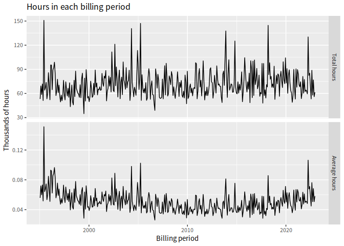
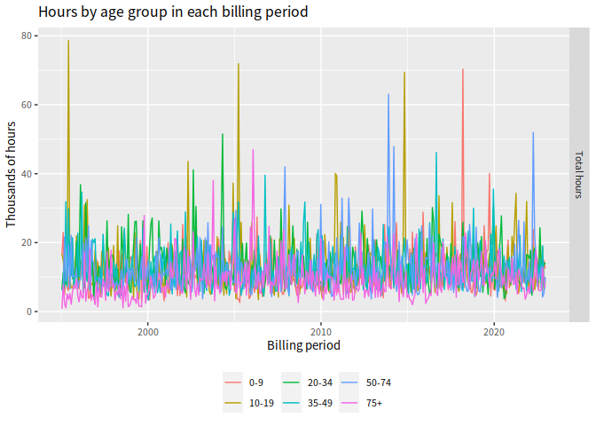
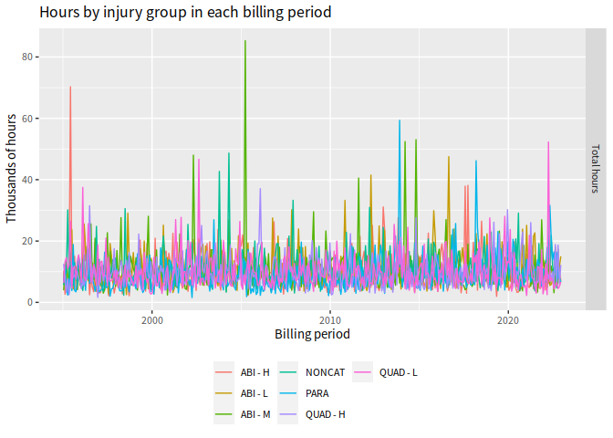
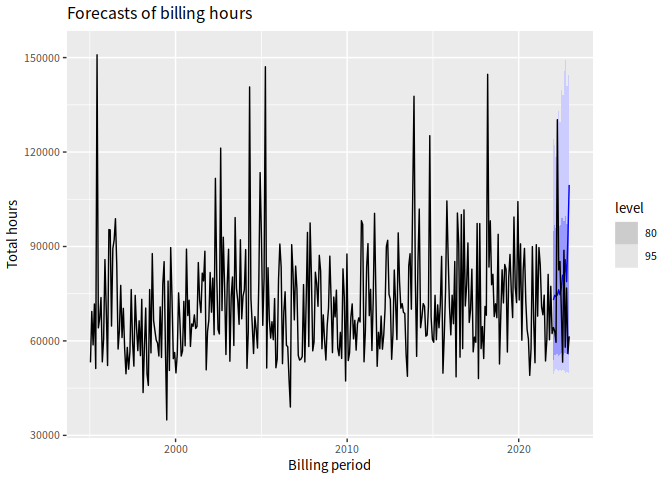
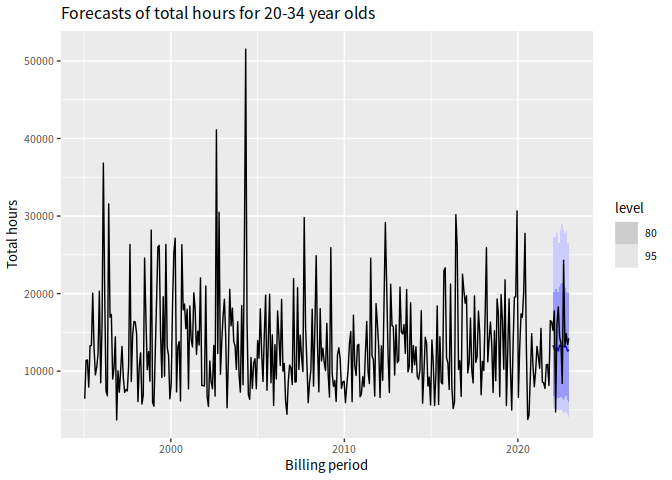
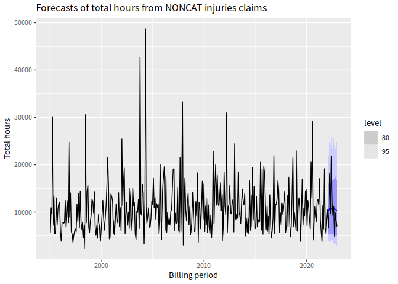

<!-- README.md is generated from README.Rmd. Please edit that file -->

# TACforecasting

This package provides functions to help with forecasting attendant care
hours for the Transport Accident Commission.

## Installation

``` r
# First install the dependencies
install.packages(c("tsibble","fabletools","abind","distributional","dplyr",
    "forcats","forecast","furrr","ggplot2","hts","janitor","lubridate",
  "MASS","readr","stringr","tibble","tidyr","tsbox","remotes"))
# Then install this package
remotes::install_github("robjhyndman/TACforecasting")
```

## Example

The data included in the package and in this example has been randomly
generated. No real data is included in this repository.

``` r
library(TACforecasting)
library(dplyr)
library(ggplot2)
```

``` r
# Read data
group_costs <- read_tac_data(
  claims_file = "data-raw/T086_claim_header.csv",
  costs_file = "data-raw/T086_attendant_care_hours.csv"
)
```

``` r
# Plot total hours by billing period
plot_total_hours(group_costs)
```



``` r

# Plot total hours per age group by billing period
plot_total_hours(group_costs, age_group, include_average = FALSE) +
   ggtitle("Hours by age group in each billing period")
```



``` r

# Plot total hours per injury group by billing period
plot_total_hours(group_costs, injury_group, include_average = FALSE) +
   ggtitle("Hours by injury group in each billing period")
```



``` r
# Compute forecasts of total hours by age group and injury group
# Keep back 2022 as test set
fable_forecasts_hours <- group_costs |> 
    filter(billing_period <= as.Date("2021-12-31")) |> 
    get_forecasts(h = 13, nsim = 200)
```

``` r
# Plot forecasts of total hours
plot_forecasts(fable_forecasts_hours, group_costs)
```



``` r

# Plot forecasts of total hours by age group
plot_forecasts(fable_forecasts_hours, group_costs, show_age_group = "20-34") +
   ggtitle("Forecasts of total hours for 20-34 year olds")
```



``` r

# Plot forecasts of total hours by injury group
plot_forecasts(fable_forecasts_hours, group_costs, show_injury_group = "NONCAT") +
   ggtitle("Forecasts of total hours from NONCAT injuries claims")
```



``` r
# Compute accuracy statistics on the 2022 test set
tac_accuracy(fable_forecasts_hours, group_costs)
#> # A tibble: 13 × 6
#>        h   RMSE    MAE  MAPE coverage   CRPS
#>    <int>  <dbl>  <dbl> <dbl>    <dbl>  <dbl>
#>  1     1  8734.  8734. 13.6         1  4549.
#>  2     2 11377. 11377. 18.0         1  5234.
#>  3     3 14535. 14535. 24.4         1  7095.
#>  4     4 55633. 55633. 42.7         0 46918.
#>  5     5  6335.  6335.  7.67        1  7137.
#>  6     6 10539. 10539. 12.4         1  8060.
#>  7     7  6697.  6697.  9.55        1  4261.
#>  8     8 27604. 27604. 51.8         1 12819.
#>  9     9  9059.  9059. 10.2         1 10042.
#> 10    10 27780. 27780. 47.9         1 10161.
#> 11    11  2025.  2025.  2.64        1  4404.
#> 12    12 36674. 36674. 65.5         1 10075.
#> 13    13 48086. 48086. 78.2         1  7002.
# Compute accuracy statistics on a rolling origin
# (This takes a long time to run)
tscv_accuracy(group_costs, h = 13, nsim = 200, init = 195, step = 6) |> 
  filter(!is.na(RMSE), h <= 24) |>
  summarise(
    RMSE = sqrt(mean(RMSE^2)),
    MAE = mean(MAE),
    MAPE = mean(MAPE),
    Coverage = 100*mean(coverage),
    CRPS = mean(CRPS),
    .by = h
  ) 
#> # A tibble: 13 × 6
#>        h   RMSE    MAE  MAPE Coverage   CRPS
#>    <int>  <dbl>  <dbl> <dbl>    <dbl>  <dbl>
#>  1     1 14632. 12606.  16.9    100    8585.
#>  2     2 15476. 13430.  20.3     93.1  8650.
#>  3     3 14358. 11845.  18.6     96.4  7707.
#>  4     4 20249. 14351.  16.1     92.9 10747.
#>  5     5 17135. 13264.  18.1     92.9  9194.
#>  6     6 19022. 12874.  16.8     92.9  9702.
#>  7     7 14318. 12238.  16.9    100    8404.
#>  8     8 16845. 14858.  22.5     92.9  9093.
#>  9     9 15683. 12777.  20.2     96.3  8134.
#> 10    10 19521. 13922.  15.8     96.3 10651.
#> 11    11 19320. 15070.  21.4     92.6  9697.
#> 12    12 19836. 14594.  19.7     88.9  9942.
#> 13    13 15915. 13276.  19.1    100    8145.
```
