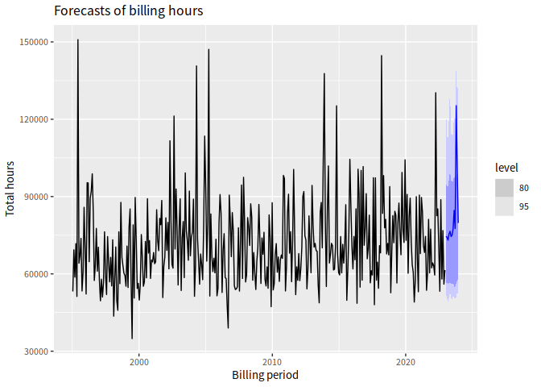
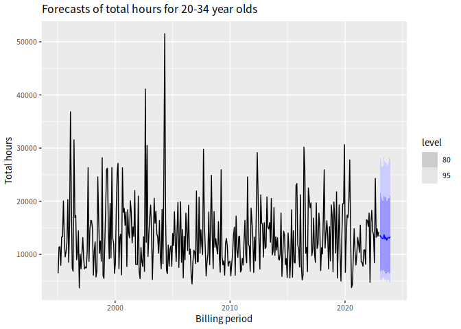
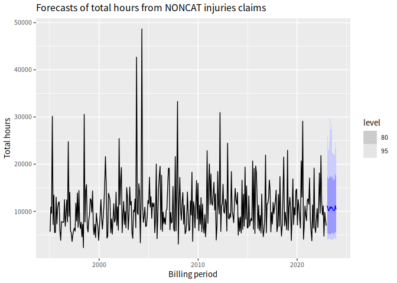

<!-- README.md is generated from README.Rmd. Please edit that file -->

# TACforecasting

This package provides functions to help with forecasting attendant care
hours for the Transport Accident Commission.

## Installation

``` r
# First install the dependencies
install.packages(c("tsibble","fabletools","abind","distributional","dplyr",
    "forcats","forecast","furrr","ggplot2","hts","janitor","lubridate",
  "MASS","readr","stringr","tibble","tidyr","tsbox","remotes"))
# Then install this package
remotes::install_github("robjhyndman/TACforecasting")
```

## Example

The data included in the package and in this example has been randomly
generated. No real data is included in this repository.

``` r
library(TACforecasting)
#> Loading required package: tsibble
#> 
#> Attaching package: 'tsibble'
#> The following objects are masked from 'package:base':
#> 
#>     intersect, setdiff, union
#> Loading required package: fabletools
library(ggplot2)
```

``` r
# Read data
group_costs <- read_tac_data(
  claims_file = "data-raw/T086_claim_header.csv",
  costs_file = "data-raw/T086_attendant_care_hours.csv"
)
```

``` r
# Plot total hours by billing period
plot_total_hours(group_costs)
```


``` r

# Plot total hours per age group by billing period
plot_total_hours(group_costs, age_group, include_average = FALSE) +
   ggtitle("Hours by age group in each billing period")
```


``` r

# Plot total hours per injury group by billing period
plot_total_hours(group_costs, injury_group, include_average = FALSE) +
   ggtitle("Hours by injury group in each billing period")
```


``` r

# Number of billing periods to forecast. Needs to be > 1
h <- 13
# Number of futures to simulate for each model
nsim <- 200

# Compute forecasts of total hours by age group and injury group
fable_forecasts_hours <- get_forecasts(group_costs, h, nsim)
#> Registered S3 method overwritten by 'quantmod':
#>   method            from
#>   as.zoo.data.frame zoo
#> Argument gnames is missing and the default labels are used.
```

``` r
# Plot forecasts of total hours
plot_forecasts(fable_forecasts_hours, group_costs)
```



``` r

# Plot forecasts of total hours by age group
plot_forecasts(fable_forecasts_hours, group_costs, show_age_group = "20-34") +
   ggtitle("Forecasts of total hours for 20-34 year olds")
```



``` r

# Plot forecasts of total hours by injury group
plot_forecasts(fable_forecasts_hours, group_costs, show_injury_group = "NONCAT") +
   ggtitle("Forecasts of total hours from NONCAT injuries claims")
```


